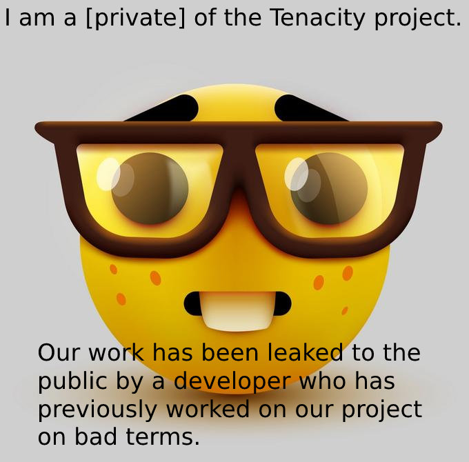

# Minecraft Client Source Codes
 Minecraft "hacked" clients, most of them are from masterof13fps.
## List
- format: Client Name (Version/Build + (DEV/Beta))
- total client amount: 48

Alphentus (1D)\
Astomero (Unknown version)\
Async (V1.0.0)\
Boomerware (V6.9)\
CloverHook (829 DEV)\
Corrosion (V2.0.0)\
Crispy (B3.67,V2.0)\
Cupid (V0.1)\
CZF (B13)\
Diablo (Unknown version)\
Drunk (V0.39)\
Eris (V0.1)\
Fanta (V13)\
Flux (V39)\
Focus (V023457)\
Hanabi (V1.5.1)\
Hawk (V1.5 Beta)\
Helium (B41420)\
Invasion (V0.3 Beta)\
Ketamine (V5.7)\
Koks (V1)\
Koks (V3)\
Koks (V4)\
Lune (V0.39)\
Massacre (B210819)\
Mega (V1.2.0)\
Metaware (Unknown version)\
Monsoon (V1.3)\
MoonX (Unknown version)\
Nevehook (V1.4, B161021)\
Novoline (V112321)\
Radium (V0.4)\
RektSky (B2)\
Remix (V1)\
Resolute (V211026)\
Rich Client Free (#0002)\
Rich Client Premium (V0.1)\
Sensation (V2.0.1)\
Sight (V2.3)\
Rise (V0.90)\
SmokeX (Unknown version)\
Strife (B210822 DEV)\
Summer (V5)\
Thunderware (B1.0)\
Tired (B70)\
UwUWare (V1.0.2)\
Vergo (B1.02)\
Zamorozka (V5.0.3)\
Tenacity (V4.0): \
https://workupload.com/file/mZvmV73XHF6 \
https://cdn.discordapp.com/attachments/942912680992313436/956203692296634368/src.zip \

## Credicts
- G8LOL
- Innominate
- jeremypelletier
- decausedinside
- Exeos
- Fxy
- Kroko 
- VincentTro
- LaVache
- AmirCC

You can find more clients here:\
https://github.com/chocopie69/Minecraft-Modifications-Codes \
https://github.com/14ms/Minecraft-Disclosed-Source-Modifications
